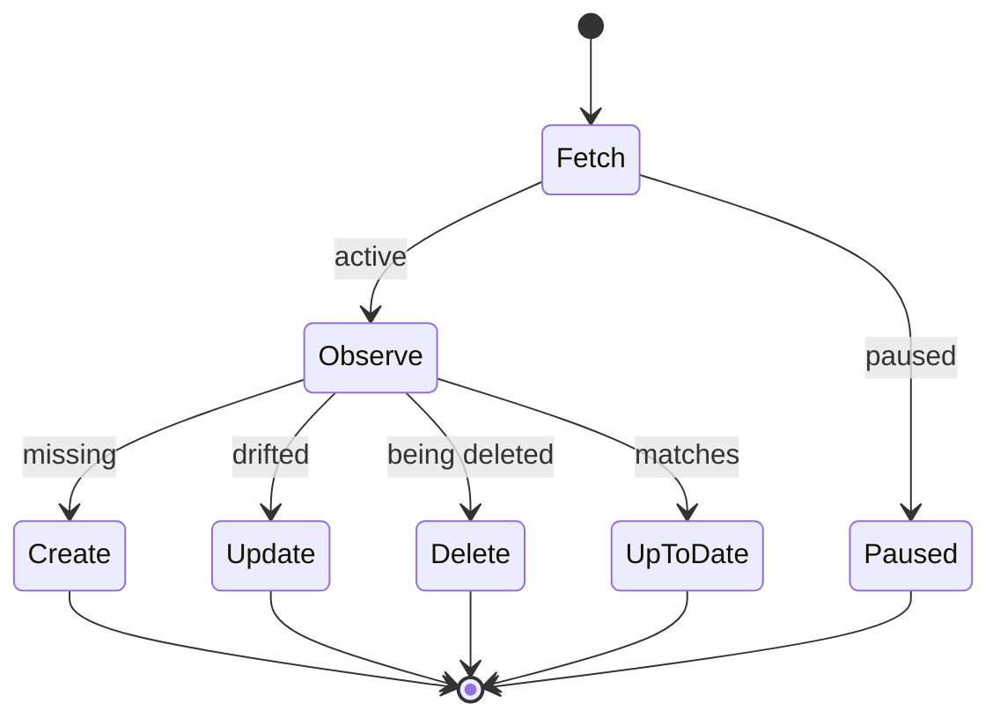

# Mental model

The lifecycle the library runs for you, and the operations you implement to plug into it.

## The managed-resource lifecycle

You hand the controller a resource type to watch and an implementation of a few operations. The watch enqueues events; a worker fetches the live object, runs the framework-level checks, then asks your code to **observe** it and — based on what you report — **create**, **update**, **delete**, or do nothing, persisting conditions and managing the finalizer along the way.

You implement the boxes; the library implements everything else — the watch and queue, fetching the live object, the pause check, finalizer add/remove, the safety steps around creation, persisting conditions and status, and requeue/retry. The full flow is in [`02-architecture.md`](./02-architecture.md).

## The operations you implement

- **Observe** — look at the external world and report whether the resource **exists** and whether it is **up to date**.
- **Create / Update / Delete** — make the external world match the desired state.

The contract that keeps this safe:

- **Idempotent and non-blocking.** The framework re-enqueues and retries, so create must tolerate an already-existing resource and delete a missing one.
- **The object arrives untyped.** You read the desired state out of the object's spec directly; there is no generated type.
- **The framework persists conditions and status, not your code.** It writes the `Ready`/`Synced` conditions onto the object's status; you report observations and errors.

> ### Headline difference from provider-runtime: there is no Connect
> `provider-runtime` has a **Connect** step that builds a client for each resource. This library has none — you register a single implementation for the whole controller, and build whatever clients you need inside the four operations. (The CDC, for instance, constructs its dynamic and Helm clients per reconcile.) Everything else about the lifecycle is the same; see [`04-equivalence.md`](./04-equivalence.md).
