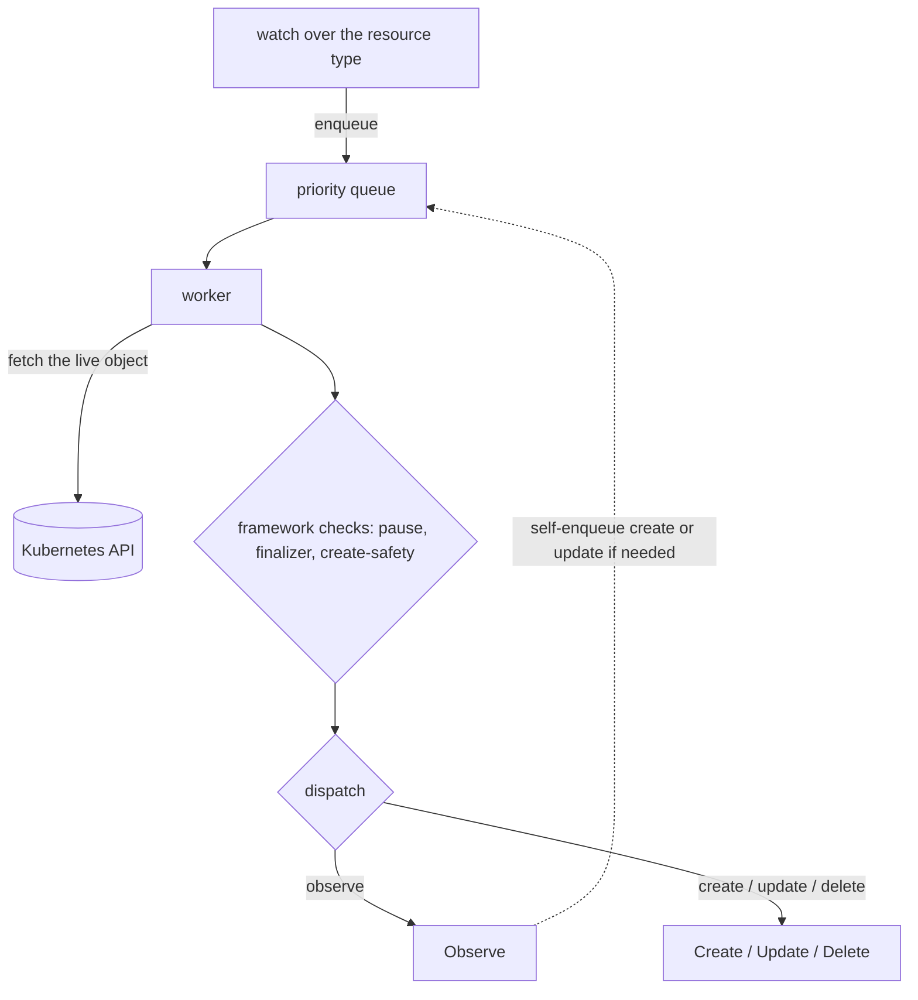

# Architecture

What the library provides, how a reconcile flows, and the truth about worker scaling.

## What's in the box

- **The controller** — the watch over a resource type, a priority work queue, a pool of workers, and the dispatch that routes each event to one of your operations.
- **Event handling** — the mapping of "what changed" to "which operation runs" is configurable (the CDC, for example, treats an update as an observe).
- **The priority queue** — de-duplicating, priority-aware, and rate-limited, so bursts are fair and retries back off.
- **Pluggable-logic helpers** — for reading desired state out of an untyped object and for writing conditions and status back.
- **Runtime type resolution** — turning a kind into the resource type to act on, since nothing is known at compile time.
- **Cross-cutting** — logging, optional telemetry, and an optional metrics server.

## How a reconcile flows

A worker pulls an event, fetches the live object, runs the framework checks (skip if paused; drop the finalizer if it's an orphan being deleted; refuse if a create is unconfirmed; add the finalizer for live objects), then dispatches to one of your operations. `Observe` doesn't create or update directly — it reports its findings, and the framework enqueues the appropriate follow-up.

## Worker scaling: the reality

The number of workers is a **fixed value passed at startup — there is no autoscaling.** The repository includes a design note on the subject, but it is **advisory**, not an implemented feature: its conclusion is that adding workers in a single instance mostly causes contention, and that the right way to scale is to **shard** — run several controller instances, each handling a slice of the resources via a label selector — and to **rate-limit** against slow external APIs. The priority queue is the fairness mechanism within an instance. So the levers are: the worker count, the priority queue, the rate limiter, and operationally, sharding. Don't go looking for an autoscaler — there isn't one.

## Two things to keep in mind

- **Status goes to the status subresource.** Conditions and status are written there, so the watched resource must define a status subresource.
- **Keep "up to date" stable.** The controller writes status, finalizers, and annotations as part of normal operation; if `Observe` reports "out of date" on inputs that didn't really change, you'll get needless churn. (Updates that only change the object's version, not its spec, are already ignored to avoid self-trigger loops.)
